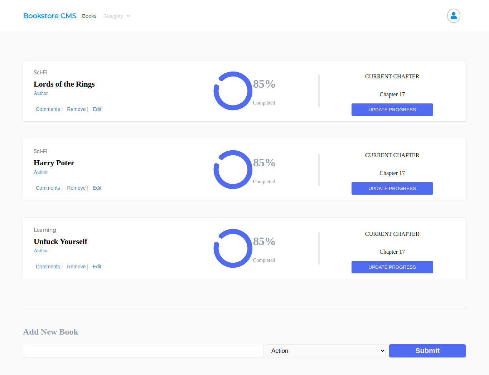

## Book Store - React && Redux

This is a book store project created with React and Redux as a state management utility.

### Screenshots

#### Main Menu

- 

### FEATURES

It allows you to add and remove books.

### BUILT WITH

- React
- Javascript
- Redux

### AUTHORS

👤 Marios Kanellopoulos

- Github: [@mariosknl](https://github.com/mariosknl)
- Twitter: [@mariosknl](https://twitter.com/MariosKnl)
- Linkedln: [marios-kanellopoulos](https://www.linkedin.com/in/marios-kanellopoulos)
- Portfolio: [marios-kanellopoulos](https://marioskanellopoulos.com/)

👤Expedito Andrade

- Github: [@githubexpjazz](https://github.com/expjazz)
- Twitter: [@expjazz](https://twitter.com/expeditoandrade13)
- Linkedin: [Expedito Andrade](https://www.linkedin.com/in/expedito-andrade-3645151a4/)
- Portfolio: [Expedito Andrade](https://expjazz.github.io/expedito_andrade/)

### Show your support

Give a star if you like this project!

### Acknowledgments

- Microverse

### 🤝 Contributing

Contributions, issues, and feature requests are welcome!
Feel free to check the issues page.

### Show your support

Give a ⭐️ if you like this project!

### 📝 License

This project is MIT licensed
